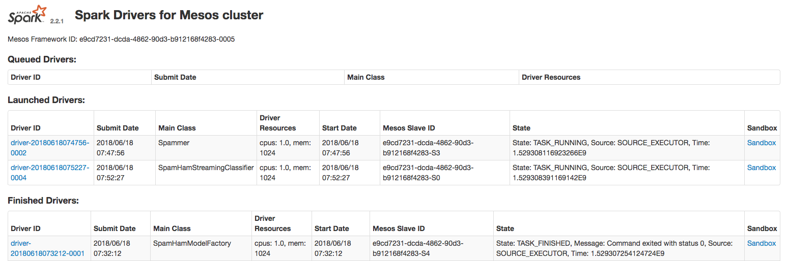

# dcos-secure-ml-pipeline

You need to provision a DC/OS Enterprise Edition cluster in either `permissive` or `strict` mode.

A DC/OS cluster with at least 7 private agents providing 28 CPU and 64 GB of RAM is required.

If you deploy it in strict mode, you need to setup the DCOS cli using `https` (dcos cluster setup `https://`).

Then, you simply need to execute the following command:

```
./deploy.sh
```

It will deploy `HDFS`, `Kafka` (with its own dedicated `ZooKeeper`) and `Spark` with `Kerberos` and `TLS`.

A `KDC` will also be deployed, but if you'd like to reuse the same approach to deploy this stack in production, you would skip this step and use your own `KDC` (which could be `Active Directory`).

The script also creates a Kafka topic (`top1`).

After that, you can launch the following script to create the model using `Spark` and the `SMSSpamCollection.txt` text file that contains examples of `spams` and `hams`. This file has already been uploaded to an Amazon S3 bucket to simplify the process.

```
./create-model.sh
```

The model is stored in `HDFS`.

Now you can execute the following script to generate new random messages. It is another `Spark` job and it's also leveraging the `SMSSpamCollection.txt` file to generate them. These messages are produced in `Kafka`.

```
./generate-messages.sh
```

Finally, you can run the following script to use the model previously created to classify the incoming messages. It will consume the messages from `Kafka` and will display the accuracy of the process in `stdout`.

```
./classify-messages.sh
```

To access `stdout`, you click on the arrow close to the `Spark` service:

 

Then, you click on the `Sandbox` link corresponding to the `SpamHamStreamingClassifier` driver:



Finally, you click on `stdout`:


You can see the accuracy displayed at the end of the log:


The 3 `Spark` jobs are using a `jar` file that has also been uploaded to an Amazon S3 bucket to simplify the process.

The source code is available [here](https://github.com/djannot/spark-build/blob/master/tests/jobs/scala/src/main/scala/SpamHam.scala).

The `hdfs-client.txt` and the `kafka-client.txt` files are showing the commands to use if you want to check the files stored in `HDFS` and the messages produced in `Kafka`.

A video going through the full demo is available on YouTube [here](https://www.youtube.com/watch?v=WMISqFRk28E).